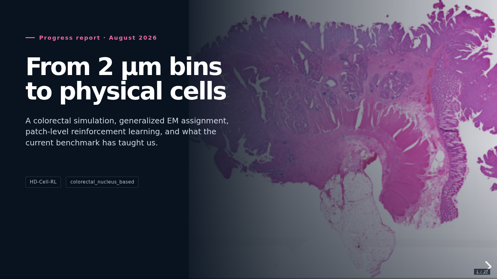

# HD-Cell-RL progress report

One-hour Reveal.js progress deck built from the current colorectal simulation benchmark and the preserved PPO overfit run. The 26-slide narrative moves from Visium HD measurement and the molecular-ownership challenge, through the full data simulation, to generalized EM, the RL objective, patch RL, training, evaluation, and the next realism-matched validation benchmark.



## Public link

The deployed presentation is available at:

**https://haoyunli.github.io/HD-Cell-RL/progress-report/**

It is published with the existing patch-debug GitHub Pages snapshot, so viewers only need a browser.

## View locally

From this directory:

```bash
python -m http.server 4173
```

Then open `http://127.0.0.1:4173`. Use the arrow keys to navigate. Add `?print-pdf` to the URL for Reveal.js PDF export mode.

Reveal.js 6.0.1 is vendored locally, so the presentation does not require internet access.

## Suggested pacing

- Motivation, cell reconstruction, and molecular ownership: 10 minutes
- Simulated-data construction, step by step: 25 minutes
- Generalized EM and patch RL architecture: 10 minutes
- Overfit training, benchmark, and RL diagnosis: 10 minutes
- Benchmark audit and next gate: 5 minutes

Many diagrams use Reveal fragments. Advance within a slide to reveal each step; this is intentional pacing for a mixed technical and non-technical audience.

## Sources used

- `Bin2Cell_Validation/outputs/pseudo_hd/colorectal_nucleus_based_multi_owner_v2`
- `runs/benchmarks/colorectal_nucleus_based_multi_owner_v2_43cells_20260826T210246Z`
- `runs/colorectal_nucleus_based_patch_overfit4_w5_validated_20260825T114854Z`
- Ishaque et al., *The Challenge of Cell Segmentation in Spatially Resolved Transcriptomics*, arXiv:2606.09675 (2026)
- [10x Genomics Visium HD Spatial Gene Expression](https://www.10xgenomics.com/support/spatial-gene-expression-hd)
- [10x Genomics Space Ranger binning algorithms](https://www.10xgenomics.com/support/software/space-ranger/latest/algorithms-overview/gene-expression)
- [10x Genomics Xenium Prime 5K panel information](https://www.10xgenomics.com/support/software/xenium-panel-designer/latest/analysis/pre-designed-panels/pre-designed-xenium-prime-5k-parts)

The deck intentionally labels the formal PPO run as a four-patch overfit experiment and the current simulation comparison as an engineering benchmark rather than a real-data accuracy claim.

The locally generated microscopy and workflow illustrations are presentation schematics. Actual project output is used for nuclear segmentation, whole-cell expansion, and patch-level diagnostics.
